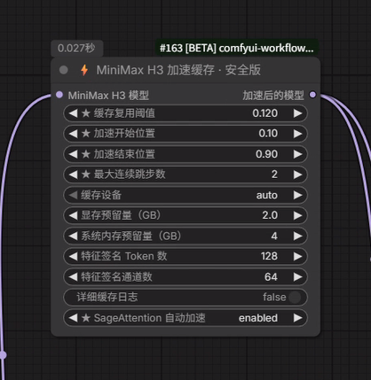

# comfyui-speed-minimaxH3

[简体中文](README.md) | **English**

A safety-focused ComfyUI acceleration package for MiniMax H3. It enables SageAttention for the diffusion model by default, reuses the full Transformer residual when adjacent sampling steps change only slightly, and can cache identical prompt/reference-image encodings while providing GPU/RAM budgeting, automatic CPU fallback, repeated-sigma isolation, and conflict detection.

## Core upgrade: dedicated SageAttention for MiniMax H3

- Provides a dedicated attention override for `MiniMaxH3Model`, with no separate third-party SageAttention node required.
- Defaults to `sage_attention=auto`, enabling SageAttention whenever the current ComfyUI and Python environment support it.
- If the installed ComfyUI or SageAttention package cannot provide the backend, the node automatically falls back to ComfyUI's default attention backend so generation can continue safely.
- If the workflow already supplies another attention override, `auto` preserves it instead of overwriting it.



> The screenshot uses forced `enabled` mode for confirmation. For normal use, keep the recommended `auto` default for acceleration with compatibility fallback.

> [!IMPORTANT]
> **Important controls are marked with `★`: reuse threshold, acceleration window, maximum consecutive skips, and SageAttention.** They directly affect speed and quality. Hover over an input label or its help icon to see its purpose, default, range, step size, trade-offs, and recommended values.

> [!WARNING]
> This node supports `MiniMaxH3Model` only. Do not chain it with EasyCache, `TE-Speed-MiniMaxH3`, `ComfyUI-MiniMaxH3-Cache`, or another full-model/full-block cache node.

## Highlights

- `sage_attention=auto` detects and enables ComfyUI's installed SageAttention implementation by default, with safe native fallback and no separate Sage node required.
- Defaults tested during continuous long-video generation: threshold `0.12`, window `10%–90%`, and at most `2` consecutive skips.
- Includes a separate `MiniMax H3 Text Encoder Cache` node: the first encode is complete, while later identical prompts, reference images, and encoding options reuse a CPU cache.
- Stores only a small sampled feature signature for change detection instead of cloning the entire hidden state for the signature.
- `auto` selects GPU, CPU, or disables caching for the current step from actual free memory and configured reserves.
- Can fall back to CPU storage after a CUDA allocation failure, reducing the chance of an immediate OOM failure.
- Runs the original model for repeated calls at the same sigma, preventing residual reuse across different CFG condition lanes.
- Detects an existing `block_loop` cache and refuses unsafe cache chaining.
- Never overwrites ComfyUI core files on disk; older ComfyUI versions receive an in-memory compatibility hook only.
- Does not call NVML or `nvidia-smi` and never changes GPU clocks, power limits, voltage, or fan settings.
- Includes native English and Simplified Chinese UI names and hover tooltips.

## Installation

### Git

Run this inside `ComfyUI/custom_nodes`:

```bash
git clone https://github.com/linjian-ufo/comfyui-speed-minimaxH3.git
```

### Manual installation

Download and extract the repository to:

```text
ComfyUI/custom_nodes/comfyui-speed-minimaxH3
```

Make sure `__init__.py` is directly inside that folder and that there is no duplicate nested folder. Restart ComfyUI, then search for:

```text
MiniMax H3 Speed Cache
```

The node is also available under `MiniMaxH3 → optimization`.

## Usage

1. Load a MiniMax H3 model.
2. Connect the loader's `MODEL` output to this node's `model` input.
3. Connect this node's `MODEL` output to the sampler that previously received the original model.
4. Start with the defaults. Enable `verbose` for the first run to inspect `RUN/SKIP` statistics in the console.
5. Compare against a no-cache result with the same prompt, seed, resolution, and step count before tuning.

The model node defaults to `sage_attention=auto`; a separate `PathchSageAttentionKJ` node is no longer necessary. If an existing workflow already supplies another attention override, `auto` preserves it instead of overwriting it.

To accelerate repeated text encoding, place `MiniMax H3 Text Encoder Cache` after `CLIPLoader (type=minimax)` and connect its `CLIP` output to the MiniMax H3 image/reference-to-video node. The first encode still runs in full; reuse occurs only when the prompt, reference images, and encoding options are identical.

If hover help does not appear, update the ComfyUI frontend and press `Ctrl+F5`. English UI uses `locales/en`; Simplified Chinese UI uses `locales/zh`.

## Default profile

These defaults were validated during continuous long-video generation and are a practical starting point. Results can still vary with the GPU, model version, resolution, frame count, prompt, and workflow.

```text
reuse_threshold          0.12
start_percent            0.10
end_percent              0.90
max_consecutive_skips    2
cache_device             auto
vram_reserve_gb          2.0
ram_reserve_gb           4.0
signature_tokens         128
signature_features       64
verbose                  false
sage_attention           auto
```

## Parameter reference

| Parameter | Default | Range / options | Purpose and tuning guidance |
|---|---:|---|---|
| **★ `reuse_threshold`** | **0.12** | 0.00–1.00, step 0.005 | Main speed/quality control. Higher values may reuse more often and run faster, but raise risks to detail, motion, and audio/video consistency. At 0.00 no steps are skipped. |
| **★ `start_percent`** | **0.10** | 0.00–1.00, step 0.01 | Sampling progress at which acceleration may start. Earlier can be faster but may affect early structure. Must be lower than `end_percent`. |
| **★ `end_percent`** | **0.90** | 0.00–1.00, step 0.01 | Sampling progress after which full computation resumes. Later can be faster but risks final texture, edges, motion, and audio detail. |
| **★ `max_consecutive_skips`** | **2** | 1–5, step 1 | Forces one full pass after this many cache reuses. Use 1 for quality. Values above 2 are not recommended without comparison tests. |
| `cache_device` | auto | auto / gpu / cpu | `auto` selects automatically; `gpu` is usually fastest but uses more VRAM; `cpu` saves VRAM but transfers may reduce speed. |
| `vram_reserve_gb` | 2.0 | 0.5–16.0 GB, step 0.5 | VRAM reserved for the model, CUDA workspace, and VAE in auto mode. Increase after OOM errors. |
| `ram_reserve_gb` | 4.0 | 1.0–32.0 GB, step 1.0 | System memory left available in auto mode. Increase when system RAM is tight. |
| `signature_tokens` | 128 | 32–512, step 32 | Number of sampled hidden-state positions. The default is normally enough; increasing it adds a small detection cost. |
| `signature_features` | 64 | 16–256, step 16 | Feature channels inspected at each sampled position. Values that are too low may reduce detection reliability. |
| `verbose` | false | true / false | Logs each `RUN/SKIP` decision and final statistics. Enable for initial testing or troubleshooting. |
| **★ `sage_attention`** | **auto** | auto / enabled / disabled | `auto` enables SageAttention when available and falls back to ComfyUI's default attention backend otherwise; `enabled` requires it; `disabled` leaves attention unchanged. |

## Alternative profiles

### Quality first

```text
reuse_threshold          0.08
start_percent            0.20
end_percent              0.80
max_consecutive_skips    1
cache_device             auto
```

### Balanced

```text
reuse_threshold          0.10
start_percent            0.15
end_percent              0.90
max_consecutive_skips    2
cache_device             auto
```

The highest-quality baseline is always a workflow without a cache node. More aggressive settings may reduce fast-motion quality, fine detail, audio/video sync, and long-video consistency.

## Safety boundary

This node does not control GPU hardware and does not bypass NVIDIA temperature or power protections. The cache can still increase GPU/CPU memory use and may cause OOM errors, failed generation, or quality changes. Users remain responsible for monitoring sustained load, temperature, cooling, power delivery, and hardware modifications.

## Compatibility

- Designed for ComfyUI versions that provide `MiniMaxH3Model`; compatibility was validated against the ComfyUI v0.30.0 interface.
- Reuses native `block_loop` support when available in newer ComfyUI versions.
- Raises a clear upgrade error when an older ComfyUI version has no `MiniMaxH3Model`.
- Does not support other video models, image models, or text-encoder models.
- On the current Torch 2.6/CUDA 12.6 stack, ComfyUI falls back to native PyTorch for the causal-mask attention used by the MiniMax text encoder. The text node therefore uses exact-result caching and does not claim to accelerate the first encode with SageAttention.

## Troubleshooting

### The node is missing

- Check that the folder is not nested as `comfyui-speed-minimaxH3/comfyui-speed-minimaxH3`.
- Check that `__init__.py` is directly inside the plugin root.
- Inspect the ComfyUI startup log for import errors.
- Restart ComfyUI and press `Ctrl+F5` in the browser.

### Existing block_loop cache error

Another full-model/full-block cache is already present in the workflow. Remove other cache nodes and restart ComfyUI. Do not chain cache implementations.

### Out of memory

Keep `cache_device=auto` and increase `vram_reserve_gb`. If memory is still insufficient, try `cache_device=cpu`; it may be slower.

### Faster output but visible quality changes

Lower `reuse_threshold`, set `max_consecutive_skips` to `1`, and narrow the window between `start_percent` and `end_percent`.

### Is SageAttention actually active?

Keep `sage_attention=auto`. The runtime log should contain `MiniMax H3 attention backend: sage-enabled`. If it says `native-fallback`, the node has safely fallen back to ComfyUI's default attention backend; generation can continue, or you can check whether SageAttention is installed in ComfyUI's Python environment. `enabled` raises an explicit error when unavailable and is useful for diagnosis.

### Why is the first text encode still slow?

The 32B text encoder must load and compute a new prompt/reference set once. The node reports a `MISS` on that first calculation and a `HIT` for later identical content. Changing any prompt, reference image, or encoding option triggers a correct full re-encode.

## Is the tests folder required?

`tests` is **not required to run the ComfyUI node**. Removing it does not affect node loading. It is intentionally kept in the public repository because it verifies cache reuse, repeated-sigma isolation, shape-change invalidation, threshold disable behavior, defaults, model cloning, and cache-conflict rejection. `__pycache__` only contains generated Python bytecode and is excluded by `.gitignore`.

Run the suite in a Python environment that can import ComfyUI and PyTorch:

```bash
python -m unittest discover -s tests -v
```

## License and acknowledgements

Released under [GPL-3.0](LICENSE). See [NOTICE.md](NOTICE.md) for design sources and third-party acknowledgements. The project contains no compiled `nodes.pyd` and does not copy or replace ComfyUI's on-disk `comfy/ldm/minimax/model.py`.
